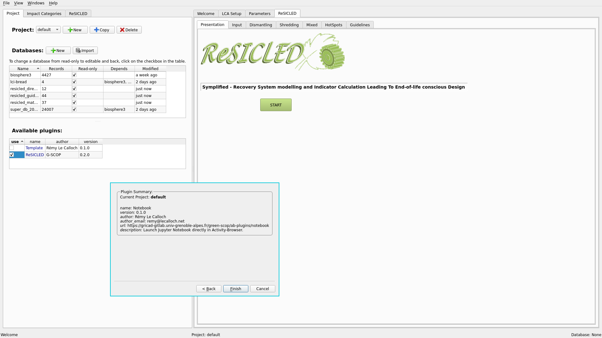

# Activity Browser - a GUI for Brightway2



The activity browser is an open source software for Life Cycle Assessment (LCA) that builds on top of the [Brightway2](https://brightway.dev) LCA framework.

This fork adds a plugin system to Activity Browser to let people create new functionalities to the software and share them easily.

**See the [original project](https://github.com/LCA-ActivityBrowser/activity-browser) for the complete README, with installation instructions and full documentation.**

## Contents
- [Quickstart](#Quickstart)
- [Setup dev environment](#setup-dev-environment)
- [Running pytest](#running-pytest)
- [Plugin manager doc](#plugin-manager-doc)
- [Authors](#authors)
- [Copyright](#copyright)
- [License](#authors)
- [Additional Resources](#additional-resources)

## Quickstart

You can install and start the activity-browser like this:

```bash
conda create -n ab -c pan6ora -c conda-forge activity-browser
conda activate ab
activity-browser
```

## Setup dev environment

You will need to have python3 and conda installed (as some dependencies are not on pip).

Then, create the environment with the following commands:

```
conda create -n local_dev -c pan6ora -c conda-forge activity-browser
conda activate local_dev
conda remove --force activity-browser
```

This create a conda environment named `local_dev` with all Activity Browser packages, then remove the package activity-browser itself (as we are going to launch it directly from the content of this repository).

To start Activity Browser clone the repo, switch to conda environment and run `run-activity-browser.py`.

Note: don't start from `prod` branche as it is only for anaconda deployement. Better create a nex branch from `plugin-manager`. If you need latest changes from the original project, start from the `master` branch and merge `plugin-manager`.

## Running pytest

Install pytest to perform automatic testing:

```
conda activate local_dev
conda install pytest pytest-qt
```

If Pytest complains about not finding some packages do the following:

```
conda deactivate
pip uninstall pytest
conda activate local_dev
conda install pytest pytest-qt
```

Run pytest:

```
pytest
```

## Plugin Manager doc

### Main characteristics

- A plugin is a 7z archive containing a Python library
- A plugin can add any content in two tabs (Left/Right)
- Plugins connect to AB through signals
- Plugins code is stored at AB global scope
- Plugins can be selected by project

### Creating a plugin

The best place to start is the [plugin template](https://github.com/Pan6ora/activity-browser-plugin-template). It's code and README will help you to understand how to create a plugin. Two things you may want to remember of are :

**classes**

There are two main classes :

- `Plugin` is the main class defined in the init file of the plugin. It inherit from the `Plugin` class defined in Activity Browser.
- `PluginTab` is the mother class of every tabs the plugin will add to AB interface (one on each left/right panel).

**hooks**

The plugin class has 4 methods that are run by AB at a certain point :

- `load()` is run each time the plugin is added tp the project or reloaded. It kind of replaces the init method.
- `close()` is run when AB get closed.Put there the code to end your plugin properly.
- `remove()` is run when the plugin is removed from the current project. Use it to clean the place.
- `delete()` is run when the plugin is fully removed from AB.

### The .plugin file

To create and share a plugin, simply put all your code (based on the plugin template) in a 7z archive, then rename it to something like MyAwesomePlugin.plugin

> Note: this behaviour will be dropped in future 2.0 release of the plugin manager in favour of conda packages.

### Storage

**Plugin code**

The code goes to AB data folder. For example on Linux :

```
/home/user/.local/share/ActivityBrowser/
plugins/
    MyFirstPlugin/
        ...
    MySecondPlugin/
        ...
```

**Plugins list**

To keep track of installed plugins, an entry is added to AB settings :

```json
/home/user/.local/share/ActivityBrowser/ABsettings.json
{
    "custom_bw_dir": "/home/user/.local/share/Brightway3",
    "plugins_list": {
        "MyFirstPlugin": {
            "author": "John Doe",
            "author_email": "john@doe.com",
            "description": "This is my first plugin",
            "name": "MyFirstPlugin",
            "url": "https://john.doe.com/myfirstplugin",
            "version": "0.1.0"
        }
    },
    "startup_project": "default"
}
```

**Plugins data**

Datas are added per-project. The plugin can add everything it needs in the project folder.

**Project plugins**

To keep track of plugins used in a project, an entry is added to project settings :

```json
/home/user/.local/share/Brigtway3/default.xxx/AB_project_settings.json
{
    "plugins_list": [
        "MyFirstPlugin",
        "MySecondPlugin"
    ],
    "read-only-databases": {
        "biosphere3": true,
        "Idemat": true
    }
}
```

### Signals

6 signals are added to manage plugins. Understanding these is the quickest way to understand how the plugin system works.

**`import_plugin = Signal()`**

trigger : 

- `menu-bar.py` | _Import Plugin..._ menu option

handlers :

- `controllers/plugin.py` | launch import plugin wizard

**`plugin_imported = Signal(object, str)`**

trigger : 

- `plugin_import_wizard.py` | plugin import successfully finished

handlers :

- `settings.py` | add plugin to AB settings

**`delete_plugin = Signal(str)`**

trigger : 

- `tables/plugin.py` | right click > _Delete plugin_ on plugin

handlers :

- `settings.py` | remove from AB settings
- `controllers/plugin.py` | delete plugin folder & run plugin delete() method

**`plugin_selected = Signal(str)`**

trigger : 

- `tables/plugin.py` | plugin box checked

handlers :

- `settings.py` | add to project settings
- `controllers/plugin.py` | import plugin & add tabs

**`plugin_deselected = Signal(str)`**

trigger : 

- `tables/plugin.py` | plugin box unchecked

handlers :

- `settings.py` | remove from project settings
- `controllers/plugin.py` | close plugin tabs & run plugin remove() method

**`plugins_changed = Signal()`**

trigger : 

- `settings.py` | plugins list changed (add or remove)

handlers :

- `tabs/project_manager.py` | update plugins list widget
- `models/plugins.py` | update plugins list table

## Authors

### Plugin manager
- Rémy Le Calloch (remy@lecalloch.net)

### Activity Browser
- Bernhard Steubing (b.steubing@cml.leidenuniv.nl)
- Matthijs Vos (m.vos@cml.leidenuniv.nl)
- Adrian Haas (haasad@ethz.ch)
- Chris Mutel (cmutel@gmail.com)
- Daniel de Koning (d.g.de.koning@cml.leidenuniv.nl)

## Contributing projects
The development of the Activity Browser was co-financed by the following projects:
- Life Cycle Management of wood in Switzerland (Swiss National Science Foundation, NRP 66 Resource Wood project number 136623)
- MIN-TEA (Materials Innovative Technologies Assessment; EIT Raw Materials project number 18231)

## Copyright
- 2017-2020: Bernhard Steubing and Daniel de Koning (Leiden University), Adrian Haas (ETH Zurich)
- 2016: Chris Mutel and Paul Scherrer Institut
- 2015: Bernhard Steubing and ETH Zurich

## License
This program is free software: you can redistribute it and/or modify
it under the terms of the GNU Lesser General Public License as published
by the Free Software Foundation, either version 3 of the License, or
(at your option) any later version.

This program is distributed in the hope that it will be useful,
but WITHOUT ANY WARRANTY; without even the implied warranty of
MERCHANTABILITY or FITNESS FOR A PARTICULAR PURPOSE.  See the
GNU Lesser General Public License for more details.

You should have received a copy of the GNU Lesser General Public License
along with this program.  If not, see <http://www.gnu.org/licenses/>.

## Additional Resources

__Activity Browser__:
- **Activity Browser**: overview paper https://doi.org/10.1016/j.simpa.2019.100012
- **Global Sensitiviy Analysis**:
  - paper describing GSA as implemented in the AB: https://onlinelibrary.wiley.com/doi/10.1111/jiec.13194
  - additional description on our Wiki: https://github.com/LCA-ActivityBrowser/activity-browser/wiki/Global-Sensitivity-Analysis
- **Modular LCA**:
  - paper on **modular LCA** using the Activity Browser: https://link.springer.com/article/10.1007/s11367-015-1015-3
  - documentation modular LCA: http://activity-browser.readthedocs.io/en/latest/index.html
  - re-implementation of modular LCA into the AB is ongoing, see here: https://github.com/marc-vdm/activity-browser/tree/mLCA

__Brightway2__:
- https://brightway.dev/
